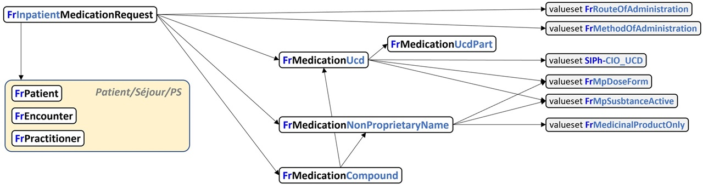
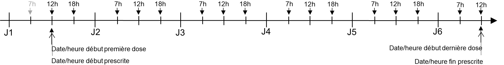
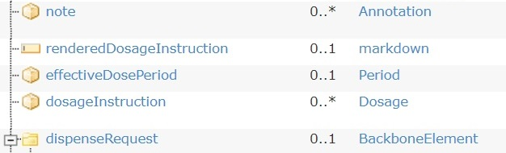
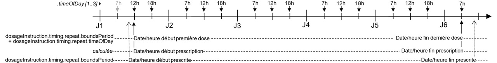
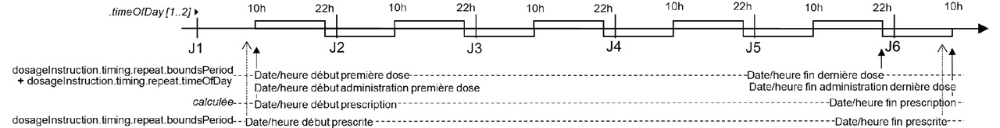

# Prescription

Le domaine couvert se limite à la **prescription intrahospitalière**.
Sont hors champ

- les prescriptions hospitalières exécutables en ville (PHEV);
- les prescriptions de médecine de ville.

## Vue d'ensemble

La prescription est un ensemble du **lignes de prescription**, représentées chacune par une ressource *MedicationRequest* profilée *FrInpatientMedicationRequest*.

La prescription en tant que telle (le regroupement de lignes de prescription), n'a pas été étudiée. Voir la rubrique [Implémentation](prescription.html#Implémentation) pour une première ébauche.

Chaque **ligne de prescription** est composée d'un **médicament prescrit** et de sa **posologie**.

Le **médicament prescrit** est représenté par *l'élément medication\[x\](1..1)* de la ressource *FrInpatientMedicationRequest* qui le contraint à faire référence à une ressource *Medication*.

Selon que ce médicament prescrit est un **médicament simple** ou un **médicament composé** de plusieurs médicaments simples et que le médicament simple est exprimé en **DC** (dénomination commune) ou en **spécialité**,
le **médicament prescrit** est représenté par trois variantes de ressource *Medication*:

- *FrMedicationUcd*: médicament exprimée en spécialité identifié par son **code UCD**. Ex: *EFFERALGAN 1 000 mg, cpr dont le code UCD est 3400893766521*
- *FrMedicationNonProprietaryName*: médicament exprimé en DC (dénomination commune)/ Ex: *paracétamol*
- *FrMedicationCompound*: médicament composé de plusieurs médicaments simples exprimées en DC ou en spécialité. Ex: *glucose 5% 1L + sodium chlorure 3g + potassium chlorure 2g, composé de 3 médicaments simples, glucose, sodium chlorure et potassium chlorure, en quantités de 1L, 3g et 2g*.

Dépendance des ressources profilées par Interop'Santé

Noter qu'un médicament simple peut être une association de plusieurs principes actifs. Ce n'en est pas moins un médicament simple représenté par une ressource *FrMedicationUcd* si c'est une spécialité ou une ressource *FrMedicationNonProprietaryName* si c'est une DC.
Ex: *CODOLIPRANE 500 mg/30 mg, cpr dont le code UCD est 3400893936047*
Ex: *paracétamol+codéine 500 mg+30 mg*

La **posologie** est représentée par l'élément dosageInstruction de la ressource *FrInpatientMedicationRequest*.

**Date de début, date de fin** et **durée de prescription**

Elles traduisent la période d'exécution de la prescription.

Cette information est portée indivuellement par chaque ligne de prescription, c'est à dire au niveau de la ressource *MedcationRequest* profilée par *FrInpatientMedicationRequest*, comme paramètre de la posologie prescrite, dans l'élément *dosageInstruction* de type *Dosage*, sous-élément *timing* de type *Timing*

- date de début : *.dosageInstruction.timing.repeat.boundsPeriod.start*
- date de fin : *.dosageInstruction.timing.repeat.boundsPeriod.end*
- durée : la durée ne figure pas dans la ressource. Elle ne peut exister qu'au niveau l'IHM. Quand elle est saisie, elle permet de calculer la date de fin à partir la date de début. Quand elle est affichée, elle est calculée à partir de la date de début et de la date de fin.

Ces dates de début et de fin de prescription, de même que la durée de prescription, ne sont pas des consignes de dispensation. Elles ne figurent donc pas dans les éléments *.validityPeriode* et *.expectedSupplyDuration* de l'élément *.dispensationRequest*.

En prescription intrahospitalière, il n'y a généralement pas de consigne de dispensation formulée par le prescripteur. Il n'y a donc généralement pas usage de l'élément *.dispensationRequest*.

### Précisions sur dates et durée de prescription

Ces précisions concernent les dates et durée de prescription de la ligne de prescription représentée par une ressource *MedicationRequest* profilée *FrInPatientMedicationRequest*.

Elles concernent également les règles définissant la **première dose prescrite** et la **dernière dose prescrites**.

Deux dates, de début et de fin, de la ligne de prescription doivent être considérées :

- La date de début et de fin **prescrite** : le plus souvent, "à partir de maintenant et pendant x jours"
- La date de début et de fin **effective** : la date/heure à partir de laquelle commence effectivement la ligne prescription, c'est-à-dire la date/heure de **début d'administration de la premier dose**, et la date/heure effective de fin de la ligne de prescription, c'est-à-dire la date/heure de **fin d'administration de la dernière dose**.

**Date/heure de fin prescrite** de la ligne de prescription (*MedicationRequest*)

Définit la date/heure de fin exprimée par le médecin lors de sa prescription.

**La première dose prescrite**:

- celle dont la date/heure de début d’administration est *immédiatement postérieure ou égale à la date/heure de début prescrite*.
- calculée à partir de la *date/heure de début prescrite*, en fonction de la posologie définie par la collection de *dosageInstruction*.

**Date/heure de fin prescrite** de la ligne de prescription (*MedicationRequest*)

Définit la date/heure de fin exprimée par le médecin lors de sa prescription.

**La dernière dose prescrite**:

- celle dont la date/heure de début d’administration est *immédiatement inférieure à la date/heure de fin prescrite*
- calculée à partir de la *date/heure de fin prescrite*, en fonction de la posologie définie par la collection *dosageInstruction*

La *date/heure de fin d’administration* de la dernière dose (sa date/heure de début + sa durée d'administration) peut être supérieure à *date/heure de fin prescrite*.

**Durée de prescription**:

Elle est liée aux deux paramétres précédents. Quand ces trois paramètres sont exposés à l'utilisateur pour saisie, en général il en fixe deux et le troisième est calculé.

Les unités UCUM suivantes sont utilisées :

1. *jour* (code = d) : égale 24h.

    - Ce n'est pas le *jour calendaire*.
    - Ainsi, 3 jours à partir de J0 07:12:34 donne comme *date de fin* J3 07:12:33.
    - Et non pas J2 23:59:59 correspondant au décompte de 3 jours calendaires.
1. *semaine* (code = wk) : égale 7 jours.
1. *mois* (code = mo) : égale 28, 29, 30 ou 31 jours selon les mois impliqués.

    - Ce n'est pas le *mois julien moyen* de 30,4375 jours défini par UCUM.
    - Ainsi, 3 mois à partir du 2021-02-14T12:34:56 donne comme *date de fin* 2021-05-14T12:34:55.
    - Et non pas 2021-04-16T20:04:55, correspondant à 2021-02-14T12:34:56 + 91 jours 7 heures 30 minutes, découlant de 3*365,25/12=91,3125 jours.

1. *année* (code = a) : égale 1 année *julienne moyenne*, soit 365,25 jours

**Garantie du nombre de doses prescrites sur une période donnée**:

Pour garantir qu'une prescription de, par exemple, 3 doses par jour pendant 5 jours, donne bien systématiquement 15 doses prescrites, comme logiquement attendu, et non pas 15 ou 16 en fonction des circonstances, il est spécifié dans ce guide d'implémentation que la *date/heure* de *fin prescrite* est exclue. En d'autres termes, l'intervalle \[ date de début prescrite, date de fin prescrite \[ est semi-ouvert.

*Illustration*
Date de fin prescrite exclue : 15 doses (3/j x 5j = 15)

En effet, si la date de début prescrite est égale à la date de début de la premiére dose, un intervalle fermé incluant de la date de fin prescrite conduira à la prescription de 16 doses.

*Illustration*
Si la date de fin prescrite était incluse : 16 doses (3/j x 5j = 16) !

**Note**:
Dans FHIR, le type *Period*, utilisé pour porter le couple (*date de début*, *date de fin*), stipule que les bornes, *start* et *end*, sont incluses. L'interval est *fermé*.

Un interval *semi-ouvert*, par exemple \[ 2021-02-14T12:34:56, 201-05-14T12:34:56 \[, se traduira par un élément *Period* dans lequel

- *start* : 2021-02-14T12:34:56
- *end* : 2021-05-14T12:34:55

**Rappel**:
Dans FHIR les horaires sont données à la seconde près : format *hh:mn:ss*. Il est précisé que l'utilisateur fait son affaire de la granularité à l'heure ou à la minute près en remplissant les minutes et les secondes manquantes par des *00*.

Néanmoins, pour exprimer l'horaire de fin exclu à la granularité horaire ou minute, il conviendra de remplir les minutes ou secondes manquantes par *59*.

Par exemple
3j à partir du 14 fév 2021 12h34 (résolution à la minute)

- *start* : 2021-02-14T12:34:00
- *end* : 2021-05-14T12:33:59

ou
3j à partir du 14 fév 2021 12h (résolution à la tranche horaire)

- *start* : 2021-02-14T12:00:00
- *end* : 2021-05-14T11:59:59

**Date/heure de début effective et Date/heure de fin effective de la ligne de prescription**:

Ces deux dates ne figurent pas dans *MedicationRequest* R4.
Dans la [R5](https://hl7.org/fhir/medicationrequest.html), un élément *effectiveDosePeriod* conçu pour accueillir ces deux dates a été ajouté.

**Note PN13**:

- Ces deux dates figurent dans l'objet ELEMENT DE PRESCRIPTION, éléments *Dh_début* et *Dh_fin*.

Les règles de gestion suivantes doivent être appliquées pour définir ces deux dates en fonction de la collection de dosageInstruction associée au *MedicationRequest*. Elles reprennent celles de PN13 et sont conformes à la [définition de la R5](https://hl7.org/fhir/medicationrequest.html).

1. La Date/heure de début effective doit être égale à la date/heure de début d’administration de la première dose décrite par la collection de *dosageInstruction*.
1. La Date/heure de fin effective doit être égale à la date/heure de fin d’administration de la dernière dose décrite par la collection de *dosageInstruction*.

*Illustration*
1 comprimé 3 fois par jour (7h, 12h, 18h) pendant 5 jours, prescrit à 10h30, à partir de maintenant (10h30), donc 1ère dose à 12h.

Notes

1. Dans cet exemple,

    - la Date/heure début prescrite est J1 10h30 ;
    - la Date/heure fin prescrite est J6 10h30 (J1 10h30 + 5j = J6 10h30) ;
    - la dernière dose est celle dont la date/heure d’administration précède la Date/heure fin prescrite (J6 10h30). Cette dernière dose a comme date/heure d’administration J6 7h. Ce qui conduit à une Date/heure fin effective de la lilgne de prescription à J6 7h.
1. Si l’administration s’effectue sur une certaine durée, perfusion, seringue électrique, etc., le calcul de la date/heure de fin d’administration de la dernière dose à partir de *dosageInstruction* doit ajouter la durée de l’administration, *dosageInstruction.doseAndRate.RateRatio.denominator*, à la date/heure de début d’administration de cette dernière dose.
1. Pour les posologies complexes, impliquant une description au travers d’une collection d’éléments *dosageInstruction* rattachés à *MedicationRequest*, c’est l’interprétation de la collection de *dosageInstruction* qui doit conduire au calcul de ces dates/heures début/fin effectives de *MedicationRequest* (fonction min() pour les dates de début, fonction max() pour les date de fin).

*Illustration*
G5 1L sur 12h, 2 fois par jour (10h, 22h) pendant 5 jours, prescrit à 9h30, à partir de maintenant (9h30), donc 1ère dose à 10h.

Note
Dans cet exemple

- la Date/heure début prescrite est J1 9h30 ;
- la Date/heure fin prescrite est J6 9h30 (J1 9h30 + 5 j = J6 9h30) ;
- la dernière dose est celle dont la date/heure de début d’administration précède la Date/heure fin prescrite (J6 9h30). Cette dernière dose a comme date/heure de début d’administration J5 22h et durée d’administration 12h. Ce qui conduit à une Date/heure fin effective prescription à J6 10h.

Pour les **posologies conditionnelles d’un évènement aléatoire**, « si douleur » par exemple, il faut prendre comme dates/heures de début/fin de *MedicationRequest* celles de la période de prise en compte de l’évènement.

- Exemple : Paracétamol 1 g si douleur de J0 à J+3.
- Les dates/heures début/fin de MedicationRequest sont respectivement J0 et J+3.

## Cas d'usage

**La ligne de prescription intiale**:
En situation réelle, n'émettre que des lignes de prescription initiales est rarement suffisant. Néanmoins, c'est la base qui permet d'explorer la complexité de la prescription selon deux axes, le médicament prescrit et la posologie.

La complexité du *médicament prescrit*

- Une spécialité
  - monosubstance dosée en quantité sous forme comprimé
  - bisubstance dosées en quantité sous forme comprimé
  - monosubstance dosée en concentration et prescrite en dose-kg
  - monosubstance dosée en concentration et prescrite en application
  - monosubstance patch dosée en quantité sur durée du patch
  - monosubstance patch dosée en quantité horaire
  - trisubstance en perfusion prête à l'emploi
- En DC
  - on retrouve le pendant des prescriptions en spécialité
  - mais en ne spécifiant que les contraintes du prescripteur
    - la DC
    - dans certains cas, la forme, le dosage
- Extemporané
  - Ce sont des médicaments fabriqués à la demande
    - par assemblage de médicaments simples
    - spécifiés soit en spécialité soit en DC
  - Les cas d'usage sont les perfusions ou le seringies électriques
    - avec un ou plusieurs médicaments
    - dilués dans un soluté.
- Préparations magistrales et préparations officinales
  - Elles sont définies dans le Code de la santé publique
    - préparation magistrale : « tout médicament préparé au vu de la prescription destinée à un patient déterminé... » ;
    - préparation officinale : « tout médicament préparé en pharmacie, inscrit à la pharmacopée ou au formulaire national... ».
  - Elles ne sont pas couvertes par ce guide d'implémentation

*La complexité de la posologie*:

- 4 axes de complexité de la posologie
  - la fréquence
  - l'horaire
  - la durée d'administration
  - la dose
- Un premier niveau de complexité est adressé par les cas d'usage :
  - fréquence : journaliére ou tout les 3 j
  - horaires : fixes
  - durée d'administration : négligeable (assimilée à nulle) ou déterminée
  - dose : exprimée en nombre d'unités de médicament prescrit (comprimé, dose-kg , application, patch, flacon) ou quantité de principe actif (mg, g)

**Les différentes variations de la ligne de prescription initiale**:

On entend par variation de la ligne prescription toute évolution de celle-ci **prescrite** par le médecin.

Il s'agit donc d'une prescription, mais qui succède à la prescription ayant créé la ligne de prescription initiale et qui la reprend en en modifiant potentiellemnt tous les paramètres horsmis la composition du médicament prescrit.

## Ressources

**Profiles**:

- [*FrInpationtMedicationRequest*](StructureDefinition-FrInpationtMedicationRequest.html)
  - Type: *MedicationRequest*
  - Une ligne de prescription
  - En fonction de la nature du médicament prescrit, référence
    - soit une ressource *FrMedicationUCD*,
    - soit une ressource *FrMedicationNonProprietaryName*,
    - soit une ressource *FrMedicationCompound*
- [*FrMedicationUcd](StructureDefinition-FrMedicationUcd.html)
  - Type: *Medication*
  - Un médicatment prescrit en spécialité (UCD)
  - Référence un à plusieurs éléments *ingredient* qui peuvent être
    - soit une ressource *FrSnomedMPSubstanceActive*
    - soit, exceptionnellement, une ressource *FrMedicationUcdPart* pour les UCD comportant des unités de composition différentes
- [*FrMedicationUcdPart](StructureDefinition-FrMedicationUcdPart.html)
  - Type: *Medication*
  - Une partie de l'UCD (ex. *comprimé bleu*)
  - Ces parties discriminant des unités de composition différentes d'une même UCD, n'ont pas de code propre. Elles sont donc dépendantes de l'UCD à laquelle elles sont rattachées.
  - Pour cette raison, cette ressource **ne peut être utilisée seule**. Elle doit être explicitement rattachée à une ressource *FrMedicationUcd*.
- [*FrMedicationNonProprietaryName*](StructureDefinition-FrMedicationNonProprietaryName.html)
  - Type: *Medication*
  - Un médicament prescrit en DC
  - Référence un à plusieurs éléments *ingredient* qui ne peuvent pas être que des ressources *FrSnomedMPSubstanceActive*
- [*FrMedicationCompound](StructureDefinition-FrMedicationCompound.html)
  - Type: *Medication*
  - Un médicament prescrit composé de spécialités et/ou de médicament en DC
  - Référence un à plusieurs composants qui peuvent être, indépendamment,
    - soit une ressource *FrMedicationUCD*,
    - soit une ressource *FrMedicationNonProprietaryName*.
- [*FrMPSubstanceActive](StructureDefinition-FrMPSubstanceActive.html)
  - Type: *CodeableConcept*
  - Une substance active des *Medical Product* SNOMED CT

**Extensions**:

- [*FrTreatmentIntent*](StructureDefinition-FrTreatmentIntent.html)
  - L'intention général du traitement (préventif, curatif, palliatif, ...)
  - Type: element *CodeableConcept*
  - Cible: ressource *MedicationRequest*
  - Binding: jeu valeurs *FrTreatmentIntent* (extensible)
- [*FrDrugCharacteristic*](StructureDefinition-FrDrugCharacteristic.html)
  - Une propriété caractéristique de médicament prescrit.
  - Par exemple, à libération prolongée
  - Type: element *complex type*
  - Cible: ressource *Medication*
  - Cette extension préfigure une évolution de la ressource *Medication* en R5.
- [*FrBasisOfDoseComponent*](StructureDefinition-FrBasisOfDoseComponent.html)
  - Le médicament composant référencé par la quantité de la dose d'un médicament composé
  - Type: element *complex type*
  - Cible: élément *doseAndRate* d'une ressource *Dosage*
- [*FrIsVehicle*](StructureDefinition-FrIsVehicle.html)
  - Le médicament composant assumant le rôle de soluté
  - Type: element *complex type*
  - Cible: ressource *Medication* ou élément *ingredient* d'une ressouce *Medication*

**ValueSets**:

- [*SIPh-CIO_UCD*](http://siph.phast.fr/free-set-ciodc/)
  - Les codes UCD valides pour identifier les spécialités
- [*FrMedicinalProductOnly*](ValueSet-FrMedicinalProductOnly.html)
  - Les codes SNOMED CT des DC
- [*FrMpSubstanceActive*](ValueSet-FrMpSubstanceActive.html)
  - Les codes SNOMED CT des substances actives des *Medicinal Product*
- [*FrRouteOfAdministration*](ValueSet-FrRouteOfAdministration.html)
  - Les codes SNOMED CT des voies d'administration
- [*FrMethodOfAdministration*](ValueSet-FrMethodOfAdministration.html)
  - Les codes SNOMED CT des méthodes d'administration
- [*FrMpDoseForm*](ValueSet-FrMpDoseForm.html)
  - Les codes SNOMED CT des formes des *Medicinal Product*
- [*FrMpUnitOfPresentation*](ValueSet-FrMpUnitOfPresentation.html)
  - Les codes SNOMED CT des unités de présentation des *Medicinal Product*
- [*FrTreatmentIntent*](ValueSet-FrTreatmentIntent.html)
  - Les codes SNOMED de l'intention général du traitement (préventif, curatif, palliatif, ...)

**CodeSystems**:

- [*SIPh-CIO_UCD*](https://siph.phast.fr/free-set-ciodc/)
  - Le code system sur lequel est construit le value set SIPh-CIO_UCD des codes UCD valides.
  - CIOdc est Copyright © 2003-2021 PHAST - France. All rights reserved.
  - Ce code system fait partie de [FreeSet CIOdc](https://siph.phast.fr/free-set-ciodc/) disponible sous licence libre.
- *SNOMED_CT* ***Lien à mettre à jour***
  - Le code system de l'ontologie sur laquelle sont construits les jeux de valeurs des propriétés des médicaments et de la clinique.
  - SNOMED CT est Copyright © 2002 International Health Terminology Standards Development Organisation (SNOMED International). All rights reserved.
- [*UCUM*](https://ucum.org/)
  - Le code system des unités de mesures.
  - UCUM est Copyright © 1999-2013 Regenstrief Institute, Inc. et The UCUM Organization, Indianapolis, US-IN. All rights reserved.

## Implémentation

Aucune consigne particulière concernant l'implémentation des ressources ne figure dans ce guide.

Les consignes générales édictées par HL7 concernant tant leur implémentation sur un serveur de ressources FHIR que leur implémentation à travers un système de messagerie FHIR, s'appliquent.

## Exemples

La ligne de prescription initiale, complexité du médicament prescrit

*Médicament simple en spécilialité*:

- [EFFERALGAN 1 000 mg, cpr, 1 à 7h, 12h et 18h per os, pendant 5j](Instances-14624.html)
- [CODOLIPRANE 500 mg/30 mg, cpr, 1 à 7h et 18h par os, pendant 5j](Instances-14625.html)
- [DOLIPRANE 2.4% ss sucre, 20 dose-kg à 7h et 18h per os, pendant 5j](Instances-14626.html)
- [DIPROSONE 0.05%, 1 application cutanée à 8h, pendant 5j](Instances-14627.html)
- [NICOREETESKIN 15 mg/16h, patch, 1 à 7h, pendant 2 semaines](Instances-14628.html)
- [MATRIFEN 75 ug/h, patch, 1 à 7h, toutes les 72h, pendant 8j](Instances-14629.html)
- [BIONOLYTE G5, sol pr perf,poche 500 mL, 1 à 10h et 22h sur 12h, pendant 5j](Instances-14630.html)

*Médicament simple en DC*:

- [paracétamol, 1 g à 7h, 12h et 18h per os, pendant 5j](Instances-14618.html)
- [paracétamol+codéine 500 mg+30 mg, 1 à 7h et 18h per os, pendant 5j](Instances-14619.html)
- [bêtaméthasone 0.05%, 1 application cutanée à 8h, pendant 5j](Instances-14620.html)
- [nicotine 15 mg/16h, patch, 1 à 7h, pendant 2 semaines](Instances-14621.html)
- [fentanyl 75 ug/h, patch 72h, 1 à 7h, tous les 3j, pendant 8j](Instances-14622.html)
- [glucose 5%+sodium chlorure 2g+potassium chlorure 1g x 500mL, 1 à 10h et 22h sur 12h, pendant 5j](Instances-14631.html)
  - Note : Il s'agit de la prescription d'une perfusion préfabriquée, prête à l'emploi, d'un médicament associant deux électrolytes à du glucose 5%. C'est une association de substances. À la différence du médicament composé qui est un assemblage extemporané de médicaments simples.
