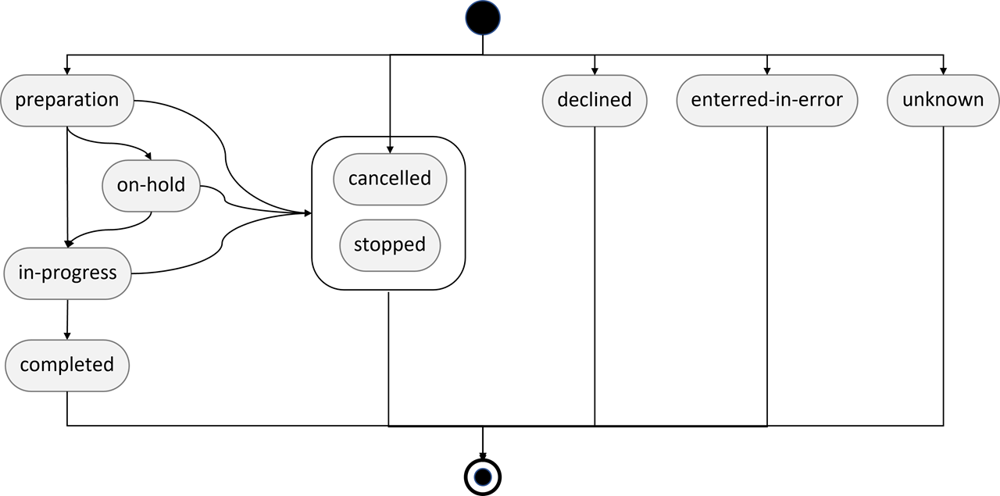

# La dispensation - Ressource MedicationDispense - Guide d'implémentation du médicament v0.1.0

* [**Table of Contents**](toc.md)
* **La dispensation - Ressource MedicationDispense**

## La dispensation - Ressource MedicationDispense

> **Attention !**la partie dispensation est en draft et n'a pas été éprouvé, un groupe de travail dédié doit être lancé afin de faire évoluer le besoin.

### Ressource MedicationDispense

La ressource MedicationDispense porte la délivrance d’un médicament et d’un seul.

* Pour décrire la délivrance de plusieurs médicaments, il faudra générer autant de MedicationDispense qu’il y a de médicaments délivrés.
* La gestion d’une délivrance multi médicaments n’est pas abordée. Entre les Bundle de type document (persistence) et les query (dynamique), FHIR offre une palette de possibilités parmi lesquelles aucune n’est à ce jour privilégiée au titre du présent guide.

#### Propriétés

voir spécification HL7 R4 : [MedicationDispense](https://hl7.org/fhir/R4/medicationdispense.html)

* `status` : statut de la délivrance. Un [jeu de valeurs](https://hl7.org/fhir/R4/valueset-medicationdispense-status.html) est **requis** par le standard (cf.infra). Il manquerait au moins une valeur entre “préparé” et “délivré”, a minima “en cours d’acheminement”.
* `medication` : le médicament délivré. C’est un médicament réel, a priori une spécialité identifiée par son code UCD. **ATTENTION** : 10 à 15% des médicaments dispensés à l’hôpital n’ont pas de code UCD, par exemple les préparations pédiatriques à partir d’une UCD. Le chapitre Prescription couvre les médicaments composés et illustre comment ils doivent être décrits (ex : une perfusion). Il ne couvre ni les préparations magistrales ni les préparations hospitalières (article L. 5121-1 du Code de la santé publique). Leur description standardisée doit faire l’objet d’un travail complémentaire qui n’a pas encore été programmé.
* `subject` : le patient ou le groupe de patients. L’option groupe de patients ouvre la possibilité de formuler une dispensation nominative reglobalisée.
* `performer` : le **préparateur** qui réalise la délivrance
* `authorizingPrescription` : la prescription pour laquelle cette délivrance est réalisée. Ou les prescriptions si la délivrance est reglobalisée.
* `type` : type de délivrance. Un [jeu de valeurs](https://hl7.org/fhir/R4/v3/ActPharmacySupplyType/vs.html) est proposé en exemple. Il ne permet pas de qualifier directement le type au sens « journalière individuelle nominative », « nominative reglobalisée », …
* `quantity` : quantité de médicament délivré.
* `daysSupply` : durée de traitement couvert (à la posologie décrite dans `dosageInstruction` des prescriptions référencées par `authorizingPrescription`). Ne porte pas la périodicité de la délivrance mais la période tirée de cette éventuelle périodicité qui est appliquée à cette délivrance.
* `whenPrepared` : quand la préparation est prête à être enlevée ou expédiée.
* `whenHandedOver` : quand la préparation est délivrée au soignant. C’est une information non disponible pour toute valeur de status recouvrant « non délivré ».
* `dosageInstruction` : posologie administrable du médicament délivré. Elle est formulée par le pharmacien compte tenu de celle de la prescription et du médicament délivré. Elle est identique à la posologie prescrite quand le médicament délivré est strictement identique au médicament prescrit.
* `destination` : l’établissement ou le lieu où la délivrance a été expédiée.
* `receiver` : la personne qui a (`status` = **completed**) ou doit (`status` ≠ **completed**) retirer le(s) médicament(s).
* `note` : note information complémentaire, en texte libre, concernant la dispensation.

#### Diagramme d’état de la propiété status

**hypothèse** faite à partir des [libellés des codes](https://hl7.org/fhir/R4/valueset-medicationdispense-status.html) (qui seraient à traduire). HL7 ne spécifie pas ce diagramme d’état.

